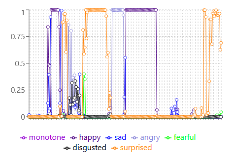

# EmoTrack
EmoTrack is a web browser based app that measures human emotions through classification of facial expression. It uses the [face-api.js](https://github.com/justadudewhohacks/face-api.js/) Javascript API, a TensorFlow based model, and a computer/smartphone front-facing camera to detect and chart facial expressions.

# Development
Install Dependencies `npm install`
Run locally `npm run start`

